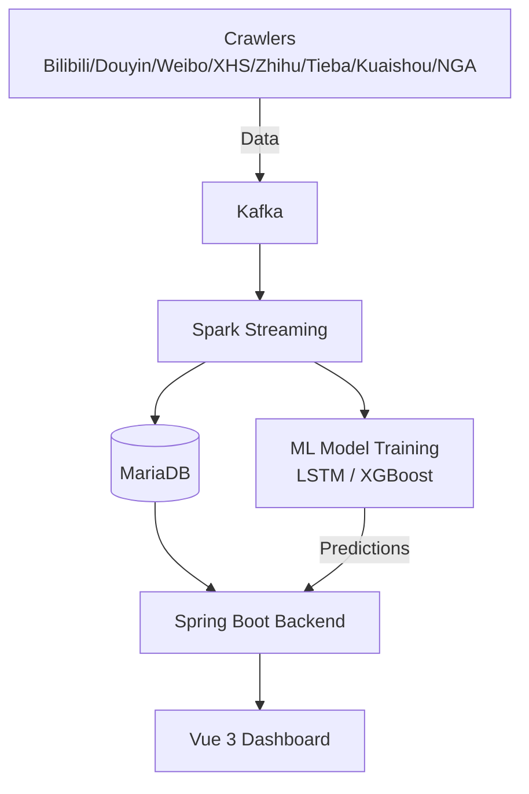

# GameOpinion — Game Sentiment Monitoring & Intelligent Analysis Platform

[](LICENSE)
[](https://openjdk.org/)
[](https://spring.io/projects/spring-boot)
[](https://vuejs.org/)
[](https://spark.apache.org/)

A full-stack big data platform for monitoring game popularity and analyzing public sentiment across Chinese social media. The system performs real-time data collection, streaming processing, sentiment analysis, and trend prediction with an interactive dashboard.

## Overview

GameOpinion crawls discussions about 21 mobile games from 7 Chinese platforms (Bilibili, Douyin, Weibo, Xiaohongshu, Zhihu, Tieba, Kuaishou + NGA game forum), processes the data through Kafka and Spark Streaming, performs NLP sentiment analysis, and visualizes the results on a real-time dashboard. The system also trains LSTM and XGBoost models to predict popularity trends.



## Tech Stack

| Layer | Technology |
|-------|-----------|
| **Crawlers** | Python, Playwright, httpx, MediaCrawler |
| **Message Queue** | Kafka (3.4) |
| **Stream Processing** | Apache Spark 3.3 (Scala), Spark Streaming |
| **Database** | MariaDB (MySQL compatible) |
| **Backend** | Spring Boot 2.7, Java 11, Spring Data JPA, Redis |
| **Frontend** | Vue 3, Vite, TypeScript, ECharts, Tailwind CSS |
| **ML/Sentiment** | PaddleNLP (ERNIE/SKEP), XGBoost, LSTM, CatBoost |
| **Deployment** | Linux, Shell scripts |

## Features

- **Multi-Platform Crawling**: 7 mainstream Chinese social media platforms + NGA game forum
- **Real-Time Streaming**: Kafka → Spark Streaming → MariaDB pipeline with 5-second micro-batches
- **Sentiment Analysis**: PaddleNLP-based sentiment classification (positive/neutral/negative)
- **Trend Prediction**: LSTM & XGBoost models for short-term (2h/12h/24h) popularity prediction
- **Hotspot Detection**: Real-time anomaly detection on interaction metrics
- **Author Analytics**: Author-level contribution ranking and engagement tracking
- **Revisit System**: Intelligent re-crawl scheduling based on content activity decay
- **Interactive Dashboard**: Real-time metrics, channel distribution, trend charts, word clouds, warning panels

## Quick Start

```bash
# Clone the repository
git clone https://github.com/yourusername/sparkhot.git
cd sparkhot

# See detailed deployment guide
cat docs/DEPLOY.md
```

### Prerequisites

- Java 11+, Maven 3.8+
- Apache Spark 3.3+
- Kafka 3.4+
- MariaDB 10+
- Node.js 18+ (for frontend)
- Python 3.8+ (for crawlers & ML)

### Environment Setup

```bash
cp .env.example .env
# Edit .env with your configuration
```

## Project Structure

```
├── backend/          # Spring Boot backend (Java)
├── crawler/          # Python crawlers (multi-platform)
│   ├── bilibili/     # Bilibili modified platform core
│   ├── nga/          # NGA game forum crawler
│   └── config.json   # Crawler configuration
├── spark/            # Spark Streaming jobs (Scala)
│   ├── src/          # Source code
│   ├── tools/        # Utility scripts (revisit daemon, author stats)
│   └── sql/          # Database schema
├── frontend/         # Vue 3 dashboard (TypeScript)
├── models/           # ML training scripts
│   ├── configs/      # Model configuration files
│   └── final_model/  # Final model metadata
├── deploy/           # Prediction service & deployment scripts
├── scripts/          # Operation & maintenance scripts
├── docs/             # Architecture, deployment & data structure documentation
└── config/           # Sample configuration files
```

## License

This project is licensed under the MIT License - see the [LICENSE](LICENSE) file for details.

## Disclaimer

This project is for educational and research purposes only. Users are responsible for complying with the terms of service of all platforms involved.
