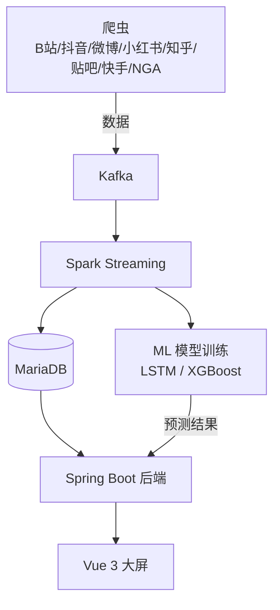

# GameOpinion — 游戏舆情监测与智能分析平台

[](LICENSE)
[](https://openjdk.org/)
[](https://spring.io/projects/spring-boot)
[](https://vuejs.org/)
[](https://spark.apache.org/)

全栈大数据平台，用于监测游戏热度并分析国内社交媒体上的公众舆情。系统实现实时数据采集、流式处理、情感分析和趋势预测，配合交互式可视化大屏。

## 概览

GameOpinion 从 7 个国内平台（B站、抖音、微博、小红书、知乎、贴吧、快手 + NGA 游戏论坛）采集 21 款手游的讨论数据，经 Kafka 和 Spark Streaming 处理后进行 NLP 情感分析，结果在实时大屏上可视化展示。系统同时训练 LSTM 和 XGBoost 模型预测热度趋势。



## 技术栈

| 层级 | 技术 |
|------|------|
| **爬虫** | Python, Playwright, httpx, MediaCrawler |
| **消息队列** | Kafka (3.4) |
| **流处理** | Apache Spark 3.3 (Scala), Spark Streaming |
| **数据库** | MariaDB (MySQL 兼容) |
| **后端** | Spring Boot 2.7, Java 11, Spring Data JPA, Redis |
| **前端** | Vue 3, Vite, TypeScript, ECharts, Tailwind CSS |
| **ML/情感** | PaddleNLP (ERNIE/SKEP), XGBoost, LSTM, CatBoost |
| **部署** | Linux, Shell 脚本 |

## 功能特性

- **多平台采集**：覆盖 7 个主流国内社交媒体平台 + NGA 游戏论坛
- **实时流处理**：Kafka → Spark Streaming → MariaDB 流水线，5 秒微批次处理
- **情感分析**：基于 PaddleNLP 的情感分类（正向/中性/负向）
- **趋势预测**：LSTM 和 XGBoost 模型进行短期（2h/12h/24h）热度预测
- **热点检测**：基于互动指标的实时异常检测
- **作者分析**：作者贡献度排行与互动追踪
- **回访系统**：基于内容活跃度衰减的智能回采调度
- **交互式大屏**：实时指标、渠道分布、趋势折线图、词云、预警面板

## 快速开始

```bash
# 克隆仓库
git clone https://github.com/MaIOqwq/gamesparkhot.git
cd gamesparkhot

# 查看详细部署指南
cat docs/DEPLOY.md
```

### 环境要求

- Java 11+, Maven 3.8+
- Apache Spark 3.3+
- Kafka 3.4+
- MariaDB 10+
- Node.js 18+（前端）
- Python 3.8+（爬虫和 ML）

### 环境配置

```bash
cp .env.example .env
# 编辑 .env 填入你的配置
```

## 项目结构

```
├── backend/          # Spring Boot 后端 (Java)
├── crawler/          # Python 爬虫（多平台）
│   ├── bilibili/     # B站平台核心
│   ├── nga/          # NGA 游戏论坛爬虫
│   └── config.json   # 爬虫配置
├── spark/            # Spark Streaming 作业 (Scala)
│   ├── src/          # 源代码
│   ├── tools/        # 工具脚本（回访守护进程、作者统计）
│   └── sql/          # 数据库表结构
├── frontend/         # Vue 3 大屏 (TypeScript)
├── models/           # ML 训练脚本
│   ├── configs/      # 模型配置文件
│   └── final_model/  # 最终模型元数据
├── deploy/           # 预测服务与部署脚本
├── scripts/          # 运维脚本
├── docs/             # 架构、部署与数据结构文档
└── config/           # 示例配置文件
```

## 许可证

本项目基于 MIT License 开源 — 详见 [LICENSE](LICENSE) 文件。

## 免责声明

本项目仅供学习和研究使用。使用者需自行遵守各平台的服务条款。
